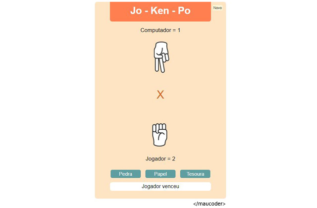

# JoKenPo (Pedra, Papel e Tesoura)

## Jogo feito utilizando html, css e javascript.
- Com contador de vitórias.
- Jogar contra o computador.
- Função para novo jogo.
- Função para zerar placar.
## Para rodar:
- Apenas faça o download ou clone o projeto.
- Abra o index.html no navegador.

Imagem das mãos, créditos: rawpixel.com
